# 🍖 Lezzet Durağı - Modern Food Ordering Platform

> **Mersin'in en lezzetli döner ve makarna restoranı için geliştirilmiş modern web uygulaması**

[](https://lezzet-duragi.vercel.app)
[](https://reactjs.org/)
[](https://www.typescriptlang.org/)
[](https://firebase.google.com/)

## 🚀 Demo

**Canlı Demo:** [lezzet-duragi.vercel.app](https://lezzet-duragi.vercel.app)

## 📸 Screenshots

### 🏠 Ana Sayfa
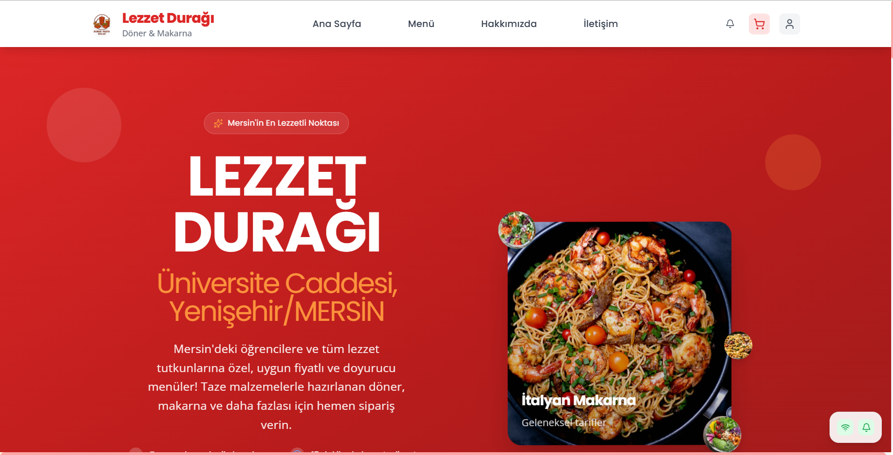
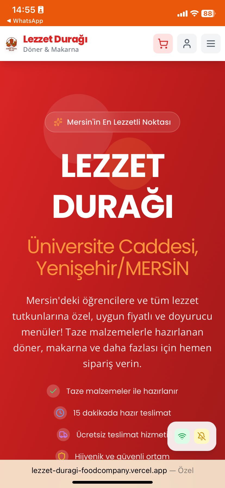

### 🍽️ Menü
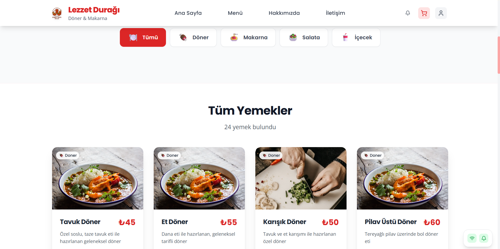
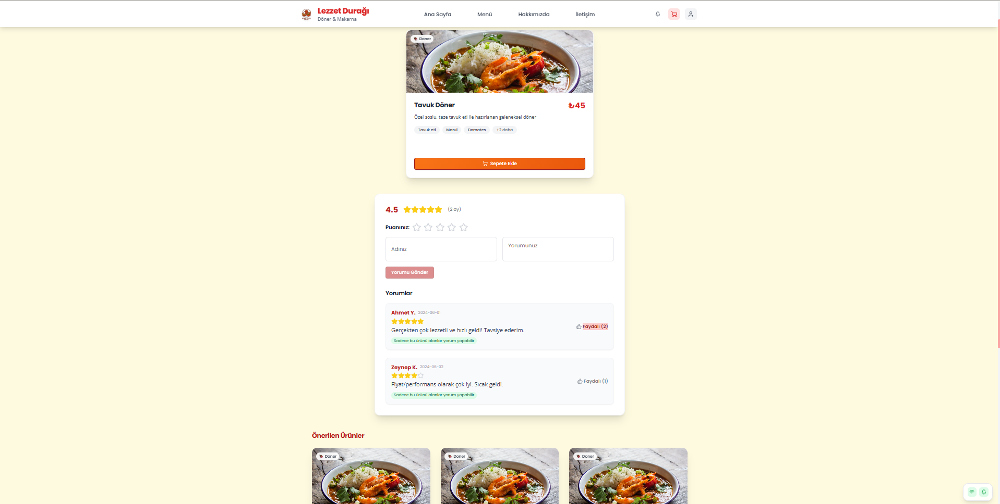

### 🛒 Sepet & Checkout
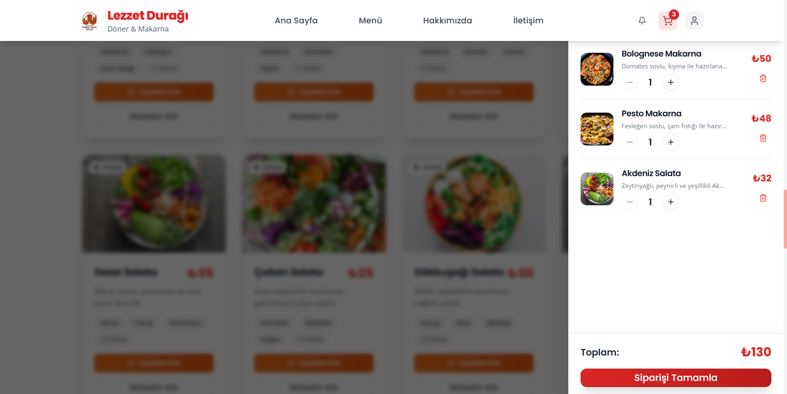
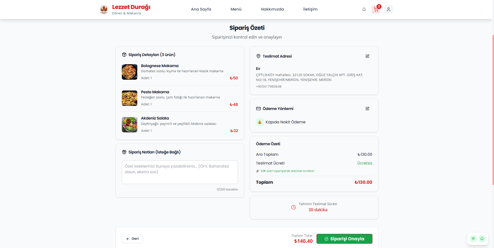

### 👨‍💼 Admin Panel
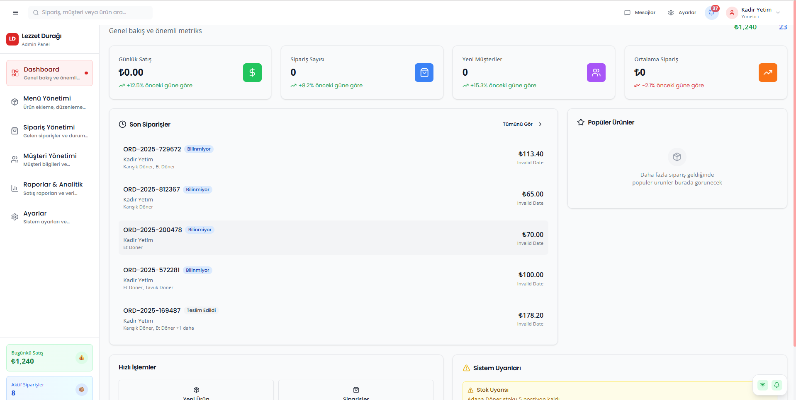
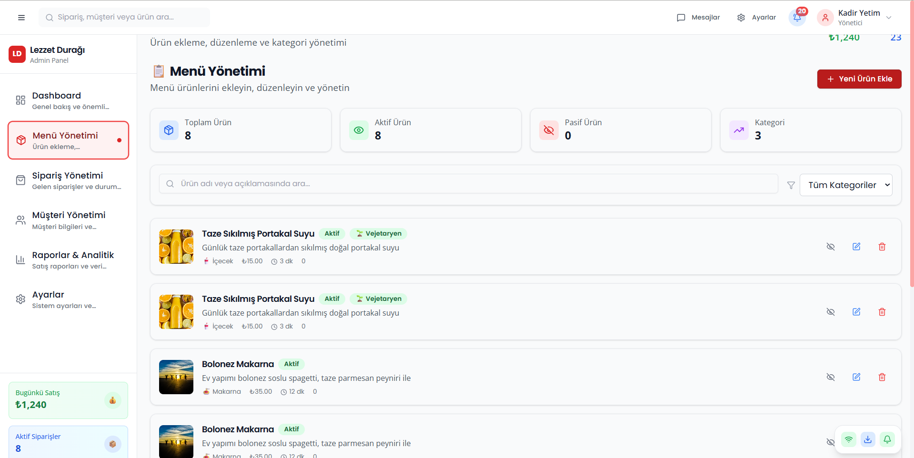
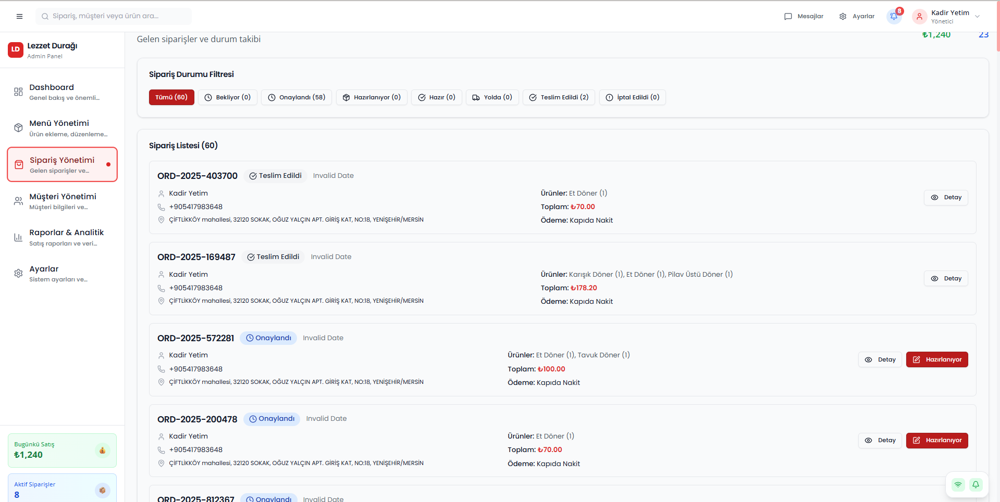
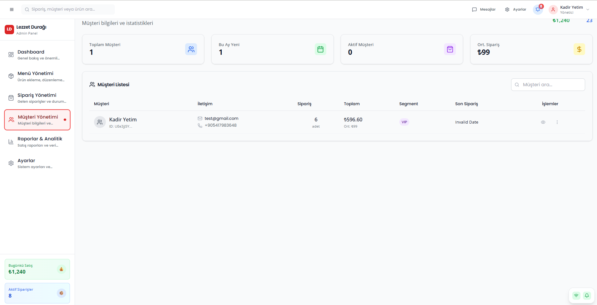

### 🔐 Authentication
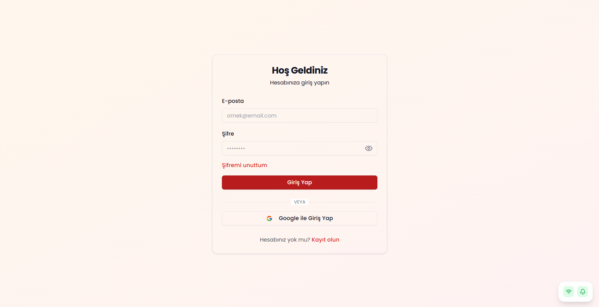
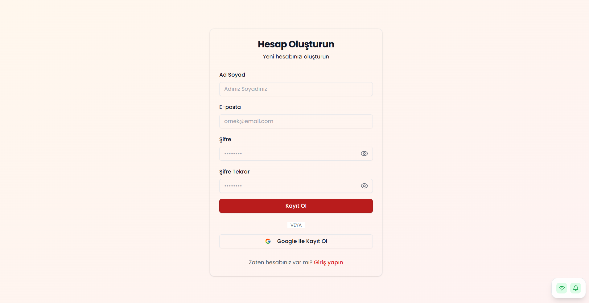

## ✨ Özellikler

### 👥 Kullanıcı Özellikleri
- 🍖 **Zengin Menü**: Döner, makarna, salata ve içecek çeşitleri
- 🛒 **Akıllı Sepet**: Gerçek zamanlı sepet yönetimi
- 📱 **Responsive Tasarım**: Mobil ve desktop uyumlu
- 🔐 **Güvenli Giriş**: Firebase Authentication (Email/Google)
- 📍 **Adres Yönetimi**: Çoklu teslimat adresi desteği
- 💳 **Güvenli Ödeme**: Stripe entegrasyonu
- 📊 **Sipariş Takibi**: Detaylı sipariş geçmişi
- 🔔 **Bildirimler**: Gerçek zamanlı sipariş bildirimleri

### 👨‍💼 Admin Panel Özellikleri
- 📈 **Dashboard**: Gerçek zamanlı satış istatistikleri
- 🍽️ **Menü Yönetimi**: Ürün ekleme/düzenleme/silme (CRUD)
- 📋 **Sipariş Yönetimi**: Sipariş durumu güncelleme
- 👥 **Müşteri Yönetimi**: Müşteri segmentasyonu ve analizi
- 📊 **Raporlar**: Satış analizi ve trend raporları
- ⚙️ **Ayarlar**: Restoran bilgileri ve çalışma saatleri

### 🛠️ Teknik Özellikler
- ⚡ **PWA Desteği**: Offline çalışma ve push bildirimleri
- 🎨 **Modern UI**: Tailwind CSS + Framer Motion animasyonları
- 🔄 **Real-time**: Firestore real-time listeners
- 🧪 **Test Coverage**: Vitest ile unit testler
- 📱 **Mobile First**: Progressive Web App

## 🛠️ Teknoloji Stack

### Frontend
- **React 19** - Modern UI framework
- **TypeScript** - Type-safe development
- **Vite** - Lightning fast build tool
- **Tailwind CSS** - Utility-first CSS
- **Framer Motion** - Smooth animations
- **Redux Toolkit** - State management

### Backend & Services
- **Firebase Auth** - Authentication
- **Firestore** - NoSQL database
- **Firebase Storage** - File storage
- **Stripe** - Payment processing
- **Vercel** - Hosting & deployment

### Development Tools
- **ESLint** - Code linting
- **Vitest** - Testing framework
- **PostCSS** - CSS processing
- **PWA** - Service worker & manifest

## 🚀 Hızlı Başlangıç

### Gereksinimler
- Node.js >= 18.0.0
- npm veya yarn

### Kurulum

```bash
# Repository'yi klonlayın
git clone https://github.com/kyetim/lezzet-duragi.git
cd lezzet-duragi

# Dependencies'leri yükleyin
npm install

# Development server'ı başlatın
npm run dev
```

### Environment Variables

```bash
# .env dosyası oluşturun (opsiyonel - Firebase config zaten kodda)
cp env.example .env

# Stripe test key'i ekleyin (opsiyonel)
VITE_STRIPE_PUBLISHABLE_KEY=pk_test_51RzJ5JHShmnVi3sJygvKmmA8W7zks40xmiOe64RkLaoEzyPrYphXRSAHLqbSnUGFGTEJKOIMrbaUkjtsU77yVWM500KazG6bIe
```

## 📜 Available Scripts

```bash
npm run dev          # Development server
npm run build        # Production build
npm run preview      # Preview production build
npm run test         # Run tests
npm run test:ui      # Test UI
npm run test:coverage # Test coverage
```

## 🏗️ Proje Yapısı

```
src/
├── components/          # React bileşenleri
│   ├── admin/          # Admin panel bileşenleri
│   ├── auth/           # Authentication bileşenleri
│   ├── cart/           # Sepet bileşenleri
│   ├── layout/         # Layout bileşenleri
│   ├── payment/        # Ödeme bileşenleri
│   └── ui/             # UI bileşenleri
├── contexts/           # React Context'ler
├── hooks/              # Custom hooks
├── interfaces/         # TypeScript interfaces
├── lib/                # Utility libraries
├── pages/              # Sayfa bileşenleri
├── services/           # API servisleri
├── store/              # Redux store
└── utils/              # Utility functions
```

## 🔧 Firebase Konfigürasyonu

Proje Firebase ile önceden konfigüre edilmiştir. Yeni bir Firebase projesi için:

1. [Firebase Console](https://console.firebase.google.com)'da proje oluşturun
2. Authentication, Firestore ve Storage'ı aktifleştirin
3. `src/lib/firebase.ts` dosyasındaki config'i güncelleyin

## 🧪 Test

```bash
# Tüm testleri çalıştır
npm run test

# Test coverage raporu
npm run test:coverage

# Test UI'ı aç
npm run test:ui
```

## 📱 PWA Özellikleri

- ✅ **Offline Support**: Service worker ile offline çalışma
- ✅ **Install Prompt**: PWA kurulum önerisi
- ✅ **Push Notifications**: Sipariş bildirimleri
- ✅ **App Manifest**: Native app benzeri deneyim

## 🚀 Deployment

### Vercel (Önerilen)

```bash
# Vercel CLI ile deploy
npm i -g vercel
vercel

# Veya GitHub ile otomatik deploy
# Repository'yi Vercel'e bağlayın
```

### Diğer Platformlar

```bash
# Build oluştur
npm run build

# dist/ klasörünü istediğiniz hosting'e yükleyin
```

## 🤝 Katkıda Bulunma

1. Fork yapın
2. Feature branch oluşturun (`git checkout -b feature/amazing-feature`)
3. Commit yapın (`git commit -m 'Add amazing feature'`)
4. Push yapın (`git push origin feature/amazing-feature`)
5. Pull Request oluşturun

## 📄 Lisans

Bu proje MIT lisansı altında lisanslanmıştır. Detaylar için [LICENSE](LICENSE) dosyasına bakın.

## 👨‍💻 Geliştirici

**Kadir Yetim**
- GitHub: [@kyetim](https://github.com/kyetim)
- Email: mr.kyetim12@gmail.com

## 🙏 Teşekkürler

- [React](https://reactjs.org/) - UI framework
- [Firebase](https://firebase.google.com/) - Backend services
- [Tailwind CSS](https://tailwindcss.com/) - CSS framework
- [Vercel](https://vercel.com/) - Hosting platform

---

⭐ **Bu projeyi beğendiyseniz yıldız vermeyi unutmayın!**
